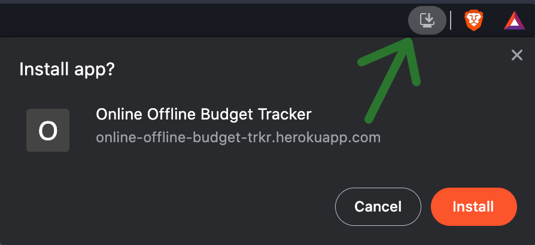

# Online Offline Budget Tracker

## An effective budget tracker that records your offline transactions to local storage, then uploads them to your online MongoDB database as soon as you're online again!

[Open](https://online-offline-budget-trkr.herokuapp.com/) Online Offline Budget Tracker:
https://online-offline-budget-trkr.herokuapp.com/

## Table of Contents

* [Installation](#installation)
* [Usage](#usage)
* [Credits](#credits)
* [License](#license)

## Installation

This Progressive Web App can either be run [directly](https://online-offline-budget-trkr.herokuapp.com/) in any modern browser, or it can be installed onto any cell phone or tablet:

^ From the address bar in a browser ^  

## Usage 

Enter your
<code>Name of Transaction</code>

and

<code>Transaction Amount</code>

then either click

<code>+ Add Funds</code>

or

<code>- Subtract Funds</code>

to visualize and track your budget effectively from anywhere - even when you don't have an internet connection!  

## Credits

* [James Boblak](https://github.com/jamesboblak)
* [W3schools.com](www.w3shools.com)
* [developer.mozilla.org](https://developer.mozilla.org/en-US/)
* [youtube.com](www.youtube.com)
* [UC Berkeley Full Stack Developer Bootcamp](https://bootcamp.berkeley.edu/coding/)

## License

[The Unlicense](https://choosealicense.com/licenses/unlicense/)

## Badge

## Tests

no tests written yet

---

 This good readme was created by [readme-generator](https://github.com/jamesboblak/readme-generator) :)